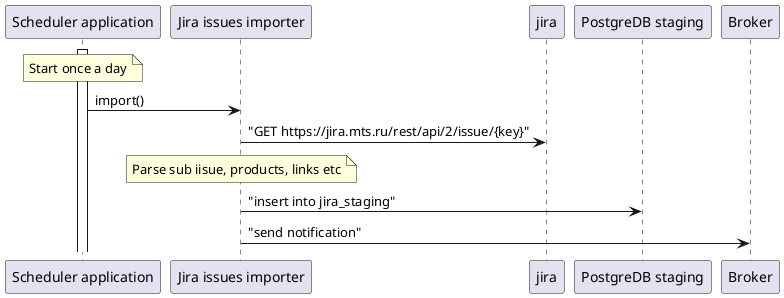

# UC00:Импорт данных о ключевых инициативах

```plantuml
@startuml
    participant "Scheduler application" as scheduler
    participant "Jira issues importer" as import_jira
    participant "jira" as jira
    participant "PostgreDB staging" as pdb
    participant "Broker" as broker
    
    activate scheduler
    note over scheduler: Start once a day
        
    scheduler -> import_jira : import()
    import_jira -> jira : "GET https://jira.mts.ru/rest/api/2/issue/{key}"

    note over import_jira: Parse sub iisue, products, links etc
    import_jira -> pdb : "insert into jira_staging"
    import_jira -> broker : "send notification"
    @enduml
```