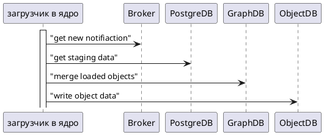

#UC01:Загрузка промежуточных данных в ядро

```plantuml
@startuml
participant "загрузчик в ядро" as load_core
participant "Broker" as broker
participant "PostgreDB" as postgredb
participant "GraphDB" as graph
participant "ObjectDB" as mongo

activate load_core

load_core -> broker : "get new notifiaction"
load_core -> postgredb : "get staging data"
load_core -> graph : "merge loaded objects"
load_core -> mongo : "write object data"
@enduml
```