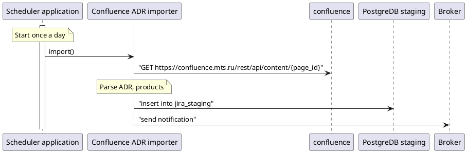

# UC03:Импорт ADR продуктов

```plantuml
@startuml
    participant "Scheduler application" as scheduler
    participant "Confluence ADR importer" as import_cnf_adr
    participant "confluence" as confluence
    participant "PostgreDB staging" as pdb
    participant "Broker" as broker

    
    activate scheduler
    note over scheduler: Start once a day
        
    scheduler -> import_cnf_adr : import()
    import_cnf_adr -> confluence : "GET https://confluence.mts.ru/rest/api/content/{page_id}"

    note over import_cnf_adr: Parse ADR, products
    import_cnf_adr -> pdb : "insert into jira_staging"
    import_cnf_adr -> broker : "send notification"
    @enduml
```