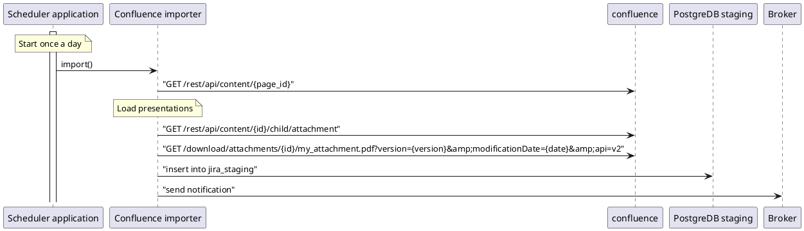

# UC04:Импорт материалов технического комитета продуктов

```plantuml
@startuml
    participant "Scheduler application" as scheduler
    participant "Confluence importer" as import_cnf_techcom
    participant "confluence" as confluence
    participant "PostgreDB staging" as pdb
    participant "Broker" as broker

    
    activate scheduler
    note over scheduler: Start once a day
        
    scheduler -> import_cnf_techcom : import()
    import_cnf_techcom -> confluence : "GET /rest/api/content/{page_id}"

    note over import_cnf_techcom: Load presentations

    import_cnf_techcom -> confluence : "GET /rest/api/content/{id}/child/attachment"
    import_cnf_techcom -> confluence : "GET /download/attachments/{id}/my_attachment.pdf?version={version}&amp;modificationDate={date}&amp;api=v2"
    
    import_cnf_techcom -> pdb : "insert into jira_staging"
    import_cnf_techcom -> broker : "send notification"
    @enduml
```