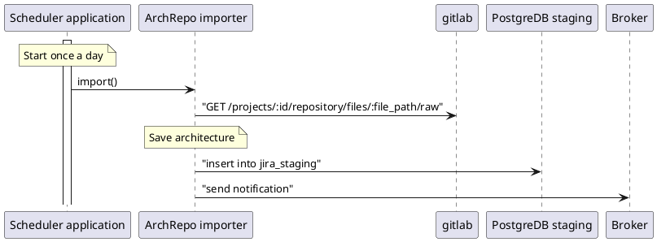

# UC05:Импорт архитектуры продуктов ArchRepo

```plantuml
@startuml
    participant "Scheduler application" as scheduler
    participant "ArchRepo importer" as import_arch
    participant "gitlab" as gitlab
    participant "PostgreDB staging" as pdb
    participant "Broker" as broker

    
    activate scheduler
    note over scheduler: Start once a day
        
    scheduler -> import_arch : import()
        ' https://docs.gitlab.com/ee/api/repository_files.html
    import_arch -> gitlab : "GET /projects/:id/repository/files/:file_path/raw"

    note over import_arch: Save architecture

    import_arch -> pdb : "insert into jira_staging"
    import_arch -> broker : "send notification"
@enduml
```