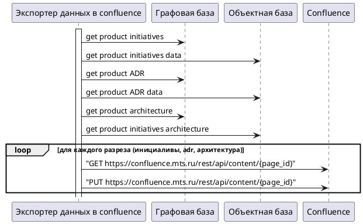

# UC06:Экспорт данных о инициативах в Confluence

```plantuml
@startuml

participant "Экспортер данных в confluence" as export_confluence
participant "Графовая база" as graph
participant "Объектная база" as object
participant "Confluence" as confluence

activate export_confluence

export_confluence -> graph : get product initiatives
export_confluence -> object : get product initiatives data
export_confluence -> graph : get product ADR
export_confluence -> object : get product ADR data
export_confluence -> graph : get product architecture
export_confluence -> object : get product initiatives architecture

loop для каждого разреза (инициаливы, adr, архитектура)
    export_confluence -> confluence : "GET https://confluence.mts.ru/rest/api/content/{page_id}"
    export_confluence -> confluence : "PUT https://confluence.mts.ru/rest/api/content/{page_id}"
end loop

@enduml
```