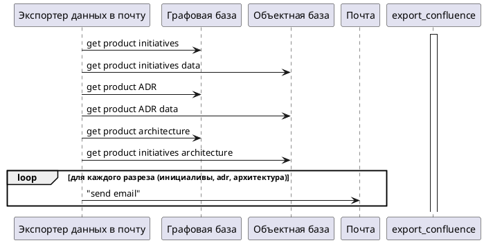

# UC07:Экспорт данных о инициативах в почту

```plantuml
@startuml


participant "Экспортер данных в почту" as export_email
participant "Графовая база" as graph
participant "Объектная база" as object
participant "Почта" as smtp

activate export_confluence

export_email -> graph : get product initiatives
export_email -> object : get product initiatives data
export_email -> graph : get product ADR
export_email -> object : get product ADR data
export_email -> graph : get product architecture
export_email -> object : get product initiatives architecture

loop для каждого разреза (инициаливы, adr, архитектура)
    export_email -> smtp : "send email"
end loop

@enduml

```