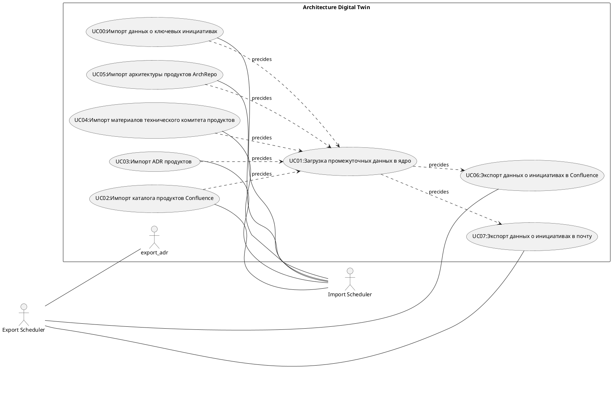

# Варианты использования

```plantuml
@startuml
left to right direction

"Import Scheduler" as import_scheduler
"Export Scheduler" as export_scheduler

rectangle "Architecture Digital Twin" as EDT {
    (UC00:Импорт данных о ключевых инициативах) as import_jira
    (UC02:Импорт каталога продуктов Confluence) as import_cnf_product
    (UC03:Импорт ADR продуктов) as import_adr
    (UC04:Импорт материалов технического комитета продуктов) as import_tk
    (UC05:Импорт архитектуры продуктов ArchRepo) as import_arch
    (UC01:Загрузка промежуточных данных в ядро) as load_core
    (UC06:Экспорт данных о инициативах в Confluence) as export_conf
    (UC07:Экспорт данных о инициативах в почту) as export_mail


    import_scheduler -u- import_jira
    import_scheduler -u- import_cnf_product
    import_scheduler -u- import_adr
    import_scheduler -u- import_tk
    import_scheduler -u- import_arch

    export_scheduler -- export_conf
    export_scheduler -- export_mail
    export_scheduler -- export_adr

    import_jira  ..> load_core : precides
    import_adr ..> load_core: precides
    import_tk ..> load_core: precides
    import_arch ..> load_core: precides
    import_cnf_product ..> load_core : precides

    load_core ..> export_conf : precides
    load_core ..> export_mail : precides
}
@enduml
```
