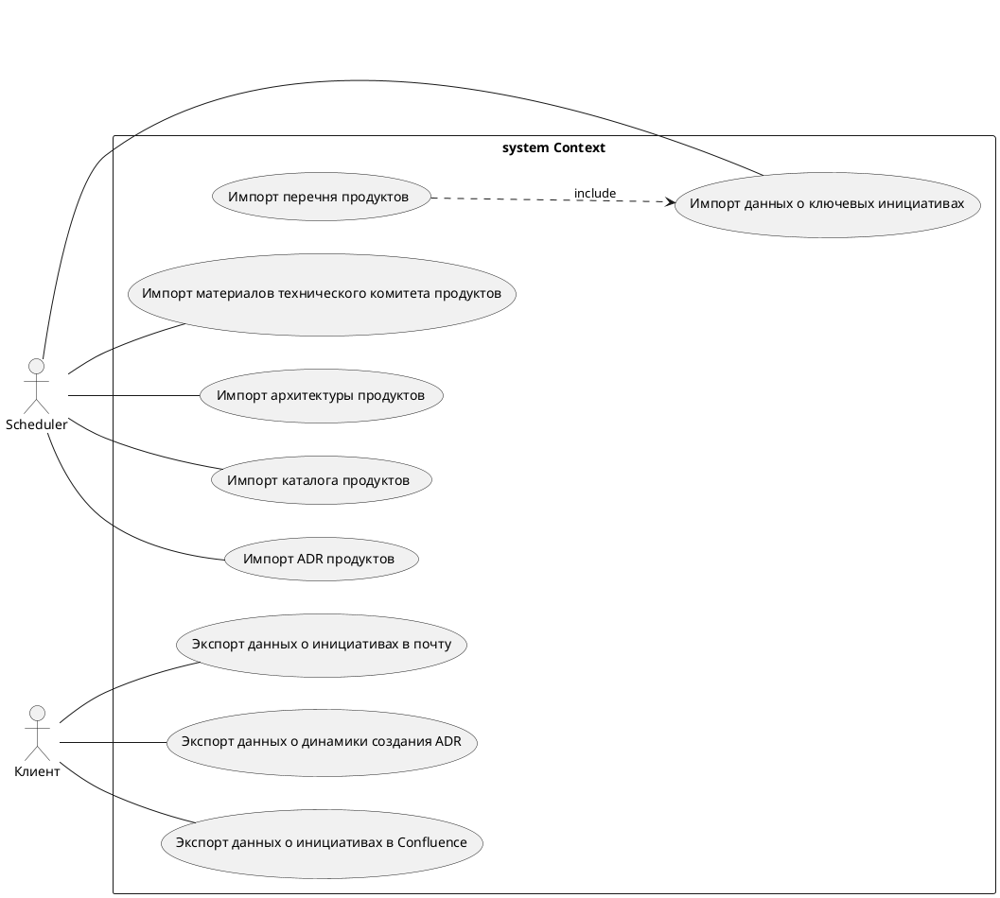

# Варианты использования

```plantuml
@startuml
left to right direction

"Scheduler" as scheduler
"Клиент" as client

rectangle "system Context" as EDT {
    (Импорт данных о ключевых инициативах) as import_jira
    (Импорт перечня продуктов) as import_jira_product
    (Импорт каталога продуктов) as import_cnf_product
    (Импорт ADR продуктов) as import_adr
    (Импорт материалов технического комитета продуктов) as import_tk
    (Импорт архитектуры продуктов) as import_arch

    (Экспорт данных о инициативах в Confluence) as export_conf
    (Экспорт данных о инициативах в почту) as export_mail
    (Экспорт данных о динамики создания ADR) as export_adr

    scheduler -- import_jira
    import_jira_product ...> import_jira : include

    scheduler -- import_cnf_product
    scheduler -- import_adr
    scheduler -- import_tk
    scheduler -- import_arch

    client -- export_conf
    client -- export_mail
    client -- export_adr
}
@enduml
```
