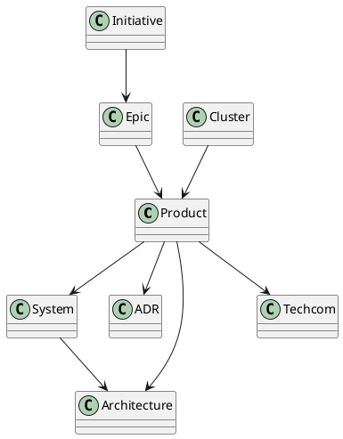

# Datamodel

```plantuml
@startuml

class Product{}
class System{}
class Initiative{}
class Epic{}
class ADR{}
class Architecture{}
class Techcom{}
class Cluster{}


Initiative --> Epic 
Epic --> Product
Cluster --> Product
Product --> Techcom
Product --> System
Product --> ADR
Product --> Architecture
System --> Architecture

@enduml
```